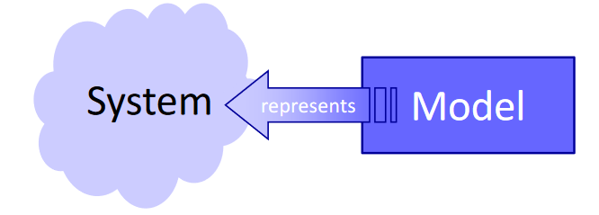
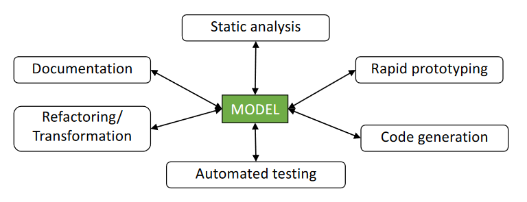
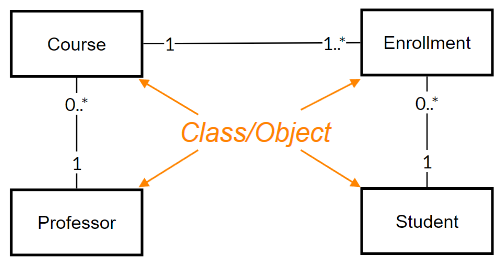
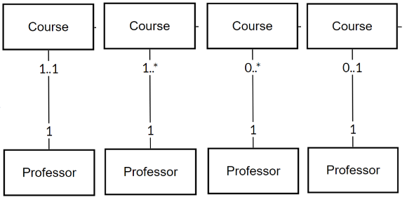
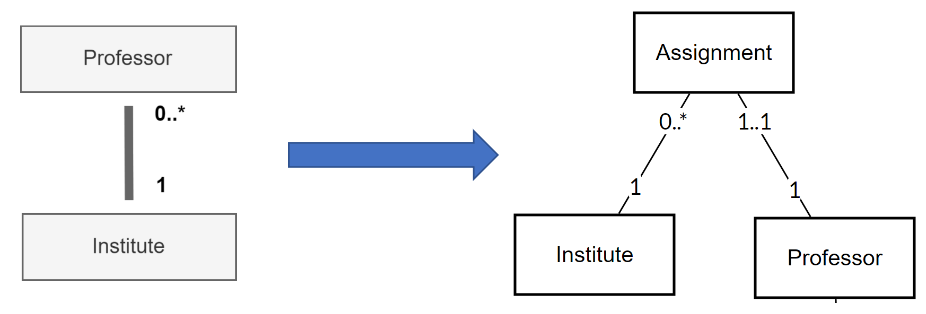
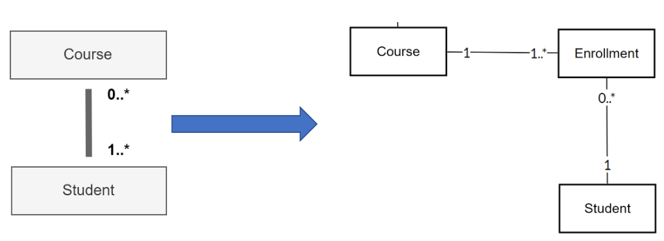
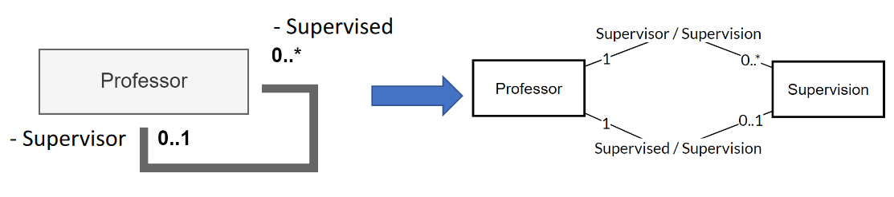
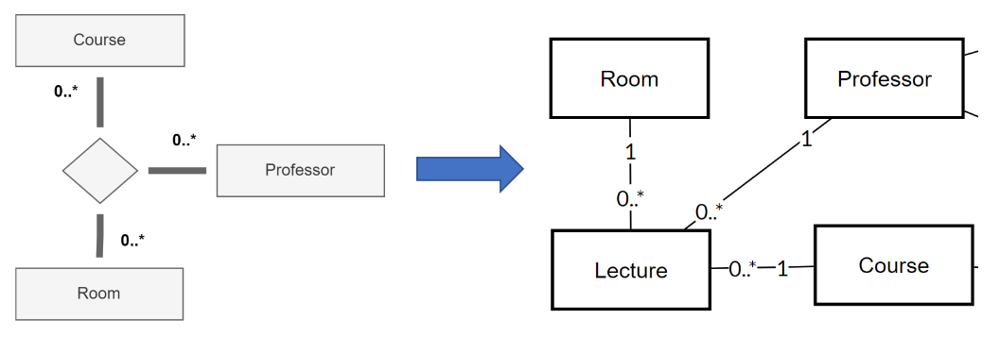
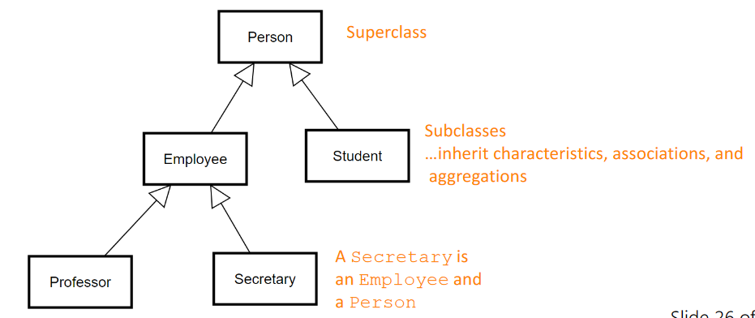
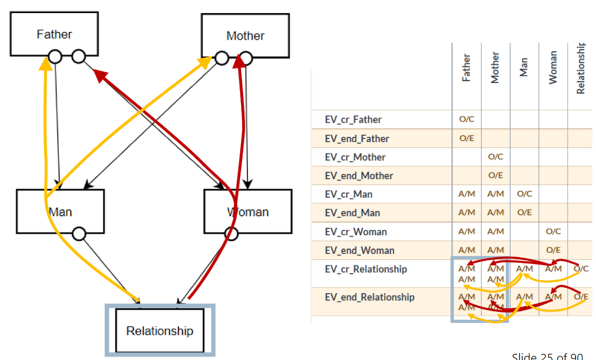

# Introduction and Motivation
* Model: Simplified or partial representation of reality
  * Model is based on original system
  * Model reflects only relevant sections of original properties
  * Model needs to be usable in place of the original
* Model driven development because...
  * more complexity, specific devices, technological progress creates problems:
  * Software finishes to late
  * Wrong function
  * Software is poorly documented
  * And not further maintainable
* Do not use models if practicallity not evaluated
* Models are not reality

# Requirements Engineering
* Software is dominant force of change:
  * Arbitrary complexity: Software products are only limited by the creators imagination
  * Instant distribution: Software can easily be distributed world-wide
  * Off-the-shelf component: Systems are derived from bought in components
* This pressures software teams to reduce software deployment cycle and time to deploy
* Requirements are basis for every software product:
  * Agree on the right product
  * Problem scope is defined first
  * Defines what stakeholders need from the system
  * Captured in natural language
  * Once agreed they drive project activity
* Representing requirements using user stories:

As `<role>`, I want to `<action>`, (so that `<benefit/goal>`)

* No technical details

# Data Modelling
* Existence-Dependency-Graph (EDG) to model static structures of a system
  * Describes elements and relationships between them

* Class/Object: Elements that exists in the system
* Associations: Relationships between Class/Objects
* Multiplicity: Describes how many objects exists in the context of a association
* Master: The object that contains the other object
  * Example: Professor is the master of Course

## Dependencies

### Objects that dependent on each other:

### Object that do not depent on each other:

### Objects with many-to-many relationship:

### Objects that depend on themselves:

### N-Ary depenencies:

## Attributes
* Attributes make an object identifiable
* Attributes give information on objects

## Generalization
* Attributes, Associations and Operations are passed to the subclass

# Object Interaction Modelling
* Business Event
  * Notification: Something that happened (in the past): George won the world cup.
  * Activity: Something that happens (in the present): I'm withdrawing money from the ATM
  * Concept: A payment
  * Request: Request to register real-world event in certain information system
* In Merlin: A request to perform activity to register something that happens or would like to happen in the real-world
* Shared vs. Unshared Event and Machine Controlled vs. Environment Controlled:
  * Shared Event & Environment Controlled: Borrowing a book
  * Unshared Event & Environment Controlled: Start reading a book
  * Shared EVent & Mashine Controlled: Automatic renewal before deadline (in a library system)
  * Unshared Event & Machine Controlled: ...

* There is always a Owner of an event
* For each owner, the events is propagaded to its master in a transitive manner

# Traceability
* https://de.wikipedia.org/wiki/R%C3%BCckverfolgbarkeit_(Anforderungsmanagement)