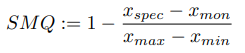
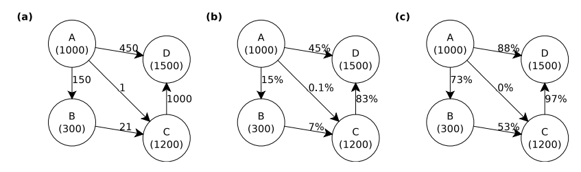

- [Key Topics](#key-topics)
  - [computing paradigms \[1.1\]](#computing-paradigms-11)
  - [microservices, patterns, trade-offs \[1.3\]](#microservices-patterns-trade-offs-13)
  - [cloud-native runtime characteristics, especially related to resilience: metaquality and replication \[6.1.2, 6.2.4\]](#cloud-native-runtime-characteristics-especially-related-to-resilience-metaquality-and-replication-612-624)
    - [metaquality](#metaquality)
    - [replication](#replication)
  - [messaging (http req/res, mq, pub/sub); http apis in particular \[3.1.3\]](#messaging-http-reqres-mq-pubsub-http-apis-in-particular-313)
  - [descriptions: openapi v3 reading/analysis \[4.3.2; spec.openapis.org\]](#descriptions-openapi-v3-readinganalysis-432-specopenapisorg)
  - [models (code and configuration)](#models-code-and-configuration)
  - [mechanics (cold start, pooling, limits, composition/workflows, ...) \[3.1.10\]](#mechanics-cold-start-pooling-limits-compositionworkflows--3110)
  - [dockerfile structure, basic syntax and quality/best practices \[2.3.3\]](#dockerfile-structure-basic-syntax-and-qualitybest-practices-233)
    - [docker images](#docker-images)
  - [same for docker-compose files \[2.3.4, 4.5.4\]](#same-for-docker-compose-files-234-454)
  - [heuristic dependency graph creation \[4.5.1\]](#heuristic-dependency-graph-creation-451)
    - [peddycord technique](#peddycord-technique)
  - [workflow deployment admission \[4.6.1\]](#workflow-deployment-admission-461)
  - [workflow prewarming \[4.6.2\]](#workflow-prewarming-462)


# Key Topics

## computing paradigms [1.1]

Computer Paradigms define how information processing is done on computers.
* Distributed Computing: Multiple computers are connected over networks (ethernet, WLAN). Also includes virtual machine that communicate over private network
  * Client-Server Computing: Client application connect to server applications through well defined protocols
  * Federated Computing: Multiple servers exists
  * Decenatrilized computing: All clients act as server (Peer-to-Peer Computing)
  * Disconnected computing: No continues access to server is required for accessing data
* Service Computing: Services are uniformely described, discoverable and invokeable entities accross networked ressources. Lately microservices are favored
* Parallel, Cluster and Grid Computing: Combines ressources like single computer, cluster of computers, grid to execute tasks and jobs
* Cloud Computing: layered set of specific service models with various cost models
  * Infrastructure as a Service (IaaS)
  * Platform as a Service (PaaS)
    * Container as a Service (CaaS)
    * Function as a Service (FaaS)
    * Backend as a Service (BaaS)
  * Software as a Service (SaaS)
* Utilty Computing: Computing capacity is supplied on a pay per use paradigm
* Serverless Computing: execution of stateless, short-lived microservices often in a Cloud Computing context
* Big Data Computing: Techniques to process large amounts of data

## microservices, patterns, trade-offs [1.3]

Presents trilemma, which represents three options from which only two can be choosen. For serverless, two fundamental 
* Cost, Quality, Speed: If outcome should be of high quality, either cost or speed have to be sacrificied
* Consistency, Availability, Partition Tolerance: One desired characteristic needs to be sacrificed, cloud providers usually choose consistency
  * Consistency: All data that is written is instantly available for reading
  * Availability: All services are always available
  * Parition tolerance: Connections between services for synchronization purposes always work and are not delayed
* Serverless Trilemma: Blackbox, Substitution, Double-Billing: Cloud providers usually sacrifice Double-Billing
  * Blackbox: Seperate interface from implementation
  * Substitution: Use workflows as drop-in replacements for single function calls
  * Double-Billing: When function A invokes function B and is waiting for B, A should not be billed

## cloud-native runtime characteristics, especially related to resilience: metaquality and replication [6.1.2, 6.2.4]
* resilience: ability to recover from failures and remain functional for the customer perspective

### metaquality
* describes how close described non-functional properties like SLAs are to realitiy
* formula:



* x_spec: specified quality (e.g. 99% availability)
* x_mon: monitored quality (e.g. 98.5% availability)
* x_max: maximum value (e.g. 100% availability)
* x_min: minimum value (e.g. 0% availability)

result: 1 - (0.99-0.985)/(1-0) = 0.995

### replication
* replication helps the availability of a service by replicating data over multiple providers
* equal distribution: data is equally distributed accross targets. each target contains (x/n) + 1 data elements (x = total data elements, n = total targets)
  * availability is then a multiplication of each targets availability
* proportional distribution: data is distributed proportionally according to metric (e.g. if metric is availability most data elements are assigned with the target of highest availability)
  * resulting availability is the same as for equal distribution
* absolut distribution: all data elements are assigned to the target with the highest or lowest metric (e.g. availability)
  * resulting availability is equal to a_i of the target hosting the data elements

## messaging (http req/res, mq, pub/sub); http apis in particular [3.1.3]
* web service is a service that is reachable over the HTTP protocol at port 80 or 443
* possible methods:
  * GET: to get a resource without modyfing the resource
  * POST: create or modify resource
  * PUT & PATCH: udpate resource
  * DELETE: delete a resource
* HTTP can be used just for request or reply over TCP socket but multiple request over same socket are also possible
* status codes: 20*: success, 30*: temporary redirections, 40*: permanent errors, 50*: internal server errors
* URL scheme: `http[s]://server[:ip]/path/to/resource?parameter=value&otherparameter=value`
* often described using service description language like OpenAPI or RAML

## descriptions: openapi v3 reading/analysis [4.3.2; spec.openapis.org]
* open api is used to describe API interfaces using YAML
* specification: https://spec.openapis.org/oas/v3.1.0#openapi-specification
* openAPI example:
```
openapi : 3.1.0
  info :
    version : 1.0.0
    title : Simple example API
    description : An API to illustrate OpenAPI

paths :
  /list :
    get :
      summary : Return stuff
      description : Returns a list of stuff
      parameters : ...
      responses :
        200:
          description : Successful response
          schema : ...
```

## models (code and configuration)

## mechanics (cold start, pooling, limits, composition/workflows, ...) [3.1.10]
* cloud vs. edge deployments: some cloud providers offer deployment on the edge instead of cloud which may be faster for some users
* memory proportionally: sometimes memory is bound to the amount of cpu cores and vice-versa
* cold starts: functions typically execute slower on the first calls
* instance recycling: functions become cold again due to strong recycle policies from cloud providers
* thread pooling and spawn starts: when a high number of function execution should run in parallel some nodes may not be warm which leads to pseudo paralleism
* processor architecture: due to different architectures deployed in the same datacenter and region different invokation may lead to different execution times
* maximum number of instances: cross-region invokation need to be considered if concurrent execution exceeds limit of choosen data center

## dockerfile structure, basic syntax and quality/best practices [2.3.3]
* dockerfiles specify how docker images are build
* no violation of best practices is reported by syntax checker but there exist mutliple linters to address this problems

### docker images
* layered file systems that contain application code and supporting libraries and tools
* they are architecture specific but can be build for multiple architectures at once which makes them somewhat platform independent

## same for docker-compose files [2.3.4, 4.5.4]
* docker compose is a light weight orchestrator to launch and link multiple docker containers
* no validation is performed by the docker compose tool but there exists e.g. the docker compose validator
* example for docker compose file:
  * two services: `imageai` and `slc`. one is build using the Dockerfile on the hosts file system and the other one is fetched from docker hub with certain commands passed when starting the docker container
```
version : "3.7"
  services :
    imageai :
    build :
      context : .
      dockerfile : Dockerfile
    slc :
      container_name : slc
      image : slc : stable
      command :
        -- config . file =/ etc / prometheus / prometheus . yml
      ports :
        - "7777:7777"
      environment :
        - DATABASE_HOST = slcmongo
        - DATABASE_PORT =27017
      depends_on :
        - imageai
      links :
        - imageai
      volumes :
        - ./ certs / CARoot . pem :/ CARoot . pem
      restart : always
```

## heuristic dependency graph creation [4.5.1]
* a system may have one or more dependencies upon which it relies on so that if it becomes unavailable the system cannot perform correctly
* depenency types:
  * fixed dependencies: must be resolved during engineering before deployment
  * loose dependencies: resolved just before the invokation of the dependency
* a dependency graph is a direct, cyclic or asyclic graph
* type of depenency analysis:
  * static: performed by analyzing service descriptions or source code
  * dynamic: performed during runtime taking traceable behaviour into account
* ways of resolving dependencies:
  * immediate resolution: dependencies and transitive dependencies are resolved immediately
  * interactive resolution: takes user feedback into account while resolving
  * SAT solvers: NP complete solvers that provide solution or otherwise proof that unsolvable problem cannot be generated

### peddycord technique



* trivial calculation: weight(A->B)/weight(A) = 150 / 1000 = 0.15 = 15%
* peddycords logarithm based ranking: log_weight(A) ( weight(A->B) ) = log_1000 (150) = 0.73 = 73%

## workflow deployment admission [4.6.1]
* Deployment algorithm works in four steps:
  1. Workflow is represented as graph (DAG directed acycled graph (https://en.wikipedia.org/wiki/Directed_acyclic_graph))
     * Greedy decomposed sequental paths
  2. All combination of paths that can execute in parallel are formed and all functions that execute in parallel are formed -> parsets
  3. Largest parset is determined based on the potential ressource consumption
  4. Deployment taskes parset information into account

## workflow prewarming [4.6.2]
* Optimistic prewarming:
  * Based on low threshold, requires lots of resources but better performance
  * e.g. all functions are pinged at the beginning
* Pessimistic prewarming:
  * Based on higher threshold, requires less ressources
  * Leads to missed predictions and the performance is therfor worse
* Horizon based prewarming:
  * Any function that is started causes its subsequent function to be prewarmed
  * -> except if these function will be blocked by other functions that need to be executed first
  * Avoid too early prewarming but no function is prewarmed to late