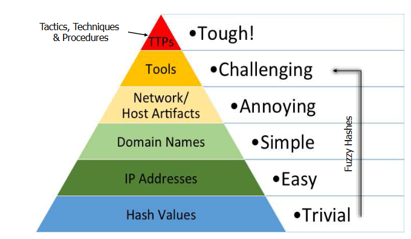

- [Securing Information Systems Overview](#securing-information-systems-overview)
  - [Goals](#goals)
  - [Information Security Management System (ISMS)](#information-security-management-system-isms)
    - [Security Guards](#security-guards)
  - [CIS Controls](#cis-controls)
    - [CIS Controls](#cis-controls-1)
    - [Critism](#critism)
  - [Measuring Security](#measuring-security)
- [Thread Landscape](#thread-landscape)
  - [Goals](#goals-1)
  - [Thread Landscape](#thread-landscape-1)
  - [Thread Actors](#thread-actors)
  - [Threats](#threats)
  - [Sources of Information](#sources-of-information)
  - [APT](#apt)
  - [Cyber Kill Chain](#cyber-kill-chain)
- [Security Controls - Security Information and Event Monitoring (SIEM)](#security-controls---security-information-and-event-monitoring-siem)
  - [Goals](#goals-2)
  - [Log Management](#log-management)
  - [SIEM](#siem)
  - [Intrusion Detection Systems](#intrusion-detection-systems)
    - [Host Intrusion Detection System (HIDS)](#host-intrusion-detection-system-hids)
    - [Host Intrusion Prevention System (HIPS)](#host-intrusion-prevention-system-hips)
    - [Network Intrusion Detection System (NIDS)](#network-intrusion-detection-system-nids)
    - [Network Intrusion Prevention System (NIPS)](#network-intrusion-prevention-system-nips)
    - [Measure Performance of IDS/IPS](#measure-performance-of-idsips)
    - [Strength and Limitation](#strength-and-limitation)
  - [Event Correlation](#event-correlation)
  - [Indicators (of Compromise)](#indicators-of-compromise)
- [Security Testing](#security-testing)
  - [Goals](#goals-3)
  - [Security Testing Methods](#security-testing-methods)
  - [Penetration Testing](#penetration-testing)
    - [Pre-engagement interactions](#pre-engagement-interactions)
    - [Intelligence Gathering](#intelligence-gathering)
      - [Browsing Targets Website](#browsing-targets-website)
      - [Search Engine Hacking](#search-engine-hacking)
      - [Infrastructure Assets](#infrastructure-assets)
    - [Thread Modeling](#thread-modeling)
    - [Vulnerability Analysis](#vulnerability-analysis)
    - [Exploitation](#exploitation)
    - [Post-Exploitation](#post-exploitation)
- [Exploitation](#exploitation-1)
  - [Goals](#goals-4)
  - [Exploit](#exploit)
  - [Stack and Stackframes](#stack-and-stackframes)
    - [Return from Function](#return-from-function)
  - [Return Oriented Programming](#return-oriented-programming)
- [Malware](#malware)
  - [Goals](#goals-5)
  - [Overview](#overview)
    - [Trojan](#trojan)
    - [Backdoor \& Remote Access Tools (RAT)](#backdoor--remote-access-tools-rat)
    - [Downloader](#downloader)
    - [Dropper](#dropper)
    - [Botnet](#botnet)
    - [Spyware](#spyware)
    - [Adware / Scareware](#adware--scareware)
    - [Randsomware](#randsomware)
    - [Virus / Worm](#virus--worm)
    - [Other Terms:](#other-terms)
    - [Rootkits](#rootkits)
  - [Malware Communication](#malware-communication)
  - [Maleware Detection](#maleware-detection)
  - [Architecture](#architecture)
  - [Signatures](#signatures)
    - [Hashes](#hashes)
    - [Fuzzy Hash](#fuzzy-hash)
    - [Byte Sequences](#byte-sequences)
    - [Heuristics](#heuristics)
    - [Behavioral Detection](#behavioral-detection)
    - [Reputation Based](#reputation-based)
    - [Machine Learning](#machine-learning)
  - [Evation](#evation)
- [Mobile Platform Security](#mobile-platform-security)
  - [Goals](#goals-6)
  - [Introduction](#introduction)
  - [IOS Security](#ios-security)
    - [Secure Bootchain](#secure-bootchain)
  - [File Encryption and Data Protection](#file-encryption-and-data-protection)
    - [Touch ID](#touch-id)
    - [Key Chain](#key-chain)
    - [App Code Signing / Review](#app-code-signing--review)
    - [Runtime Security and Sandboxing](#runtime-security-and-sandboxing)
    - [Permissions](#permissions)
    - [Inter-App Communication](#inter-app-communication)
    - [Jailbreaking](#jailbreaking)
- [Android](#android)
    - [Runtime Security and Sandboxes](#runtime-security-and-sandboxes)
    - [Permissions](#permissions-1)
    - [Code Signing and apk distribution](#code-signing-and-apk-distribution)
    - [Inter-App communication](#inter-app-communication-1)
    - [File Encryption](#file-encryption)
    - [Rooting](#rooting)
- [Mobile App Security](#mobile-app-security)
  - [Goals](#goals-7)
  - [Data Storage and Data Leakage](#data-storage-and-data-leakage)
  - [Secure Communication](#secure-communication)
  - [Authentication and Authorization](#authentication-and-authorization)
  - [Inter-App communication](#inter-app-communication-2)
  - [Client Side Injection](#client-side-injection)
  - [Reverse Engineering](#reverse-engineering)

# Securing Information Systems Overview

## Goals
* You know what it means to secure information systems and understand that it is a many-faceted problem that no single person can learn to address/solve on its own
* You know an example of a best practice guide on important security controls to secure information systems and understand its role and level of detail
* You understand that security is difficult to measure, and you know some options on how to deal with it

## Information Security Management System (ISMS)
* Systematic approach to manage information so that is stays secure -> also e.g. applies to people not only hardware and software
* Abstraction Level is usually high because they should be generically applied to most industries
* ISO 27001 has 93 security controls
* Implementation is done by management and is difficult
* As a result CIS Critical Security Controls were developed

### Security Guards
* Safeguards or countermeasures: avoid, detect, counteract, minimze security risks
* Grouped by: types, information security property (confidentiality, integrity, availability), function (function within the ISMS), category (what it concerns)
* Types:
  * Preventive Control: Prevent incident from occuring
  * Detective Control: Identify and characterize incident in progress
  * Corrective Control: Limit extend of damage caused by incident

## CIS Controls
* Contains 18 security controls for best practices
* Revised by many different experts
* Each security control contains:
  * Overview with brief description
  * Reasoning of importance
  * Detailed description of processes and tools
  * Safeguards that should be implemented

* Number specifies importance of security control
* This security control contains 7 safeguards
* 2 of which are in IG1 category
* 6 in IG2
* and 7 in IG3

### CIS Controls
* IG1:
  * Can be implemented with limited knowledge
  * For small businesses or home office
  * Good if sensitivy of data to protect is low
* IG2:
  * Requires enterprise grade technology and security teams to implement
  * Good if:
    * Business must comply with regulations
    * Sensitive customer data
    * Loss of public trust
* IG3:
  * Requires experts from different security areas
  * Good if:
    * Handling of sensitive information
    * Heart of business is availability, confediantility and integrity of sensitive data
    * Significant harm to the public

### Critism
* Most companies do not implement all

## Measuring Security
* Measuring of security is hardly possible
* Approaches:
  * Security: Audits, Penetration Test, Use measures of performance for implementing ISMS
  * Risk: Risk = Likehood x Impact but estimation of likelihood difficult
* NIS 800-55 and ISO 27004:2016

# Thread Landscape

## Goals
* You know what a threat landscape is and why it is important to track it
* You can pinpoint sources of information for tracking the threat landscape
* You know about the most relevant threats in the past two years and can point out some trends
* You can explain terms and concepts often heard when talking about the threat landscape, especially advanced persistent threat and the cyber kill chain

## Thread Landscape
* Thread Landscape: Collection of: Threads, Thread Actors and Observed Threads
* Useful to know your enemy and prepare
* Is also important to understand risk:
  * Risk = Likelihood x Impact -> Likelihood depends on thread landscape
* Important Elements:
  * Thread actors (state actors, cyber criminal)
    * Attributes: motivation, skill and resources, organization, tactics
  * Threads (type, target, attack vectors -> how the attack works)
* No standard way to document or characterize it

## Thread Actors
* Cybercrime:
  * Motivation: Money
  * Resources: Medium to High
  * Skill: Low to High
* Nation States / State-Sponsored
  * Motivation: Strategic objective (espionage etc.)
  * Resources: High
  * Skill: High
* Hacker for Hire
  * Motivation: Work/Job
  * Resources: High
  * Skill: Professional
  * Usually hired by government and operate legally in their country
* Hacktivist
  * Motivation: Work
  * Resources: Low
  * Skill: Low to Medium
  * Individuals or loosely organized groups
  * Are driven by politicial or social beliefs
* Insider
  * Motivation: Extortion, revenge, sabotage or profit
  * Resources: Low
  * Skill: Low to Medium
  * They usually have legitimate access to system and know protections
* Script Kiddy:
  * Use tools developed by others
  * *-as-a-Service might increase threat
* Cyber terrorist:
  * No common definition
  * Terrorist activities to distrub system to create panic and alarm

## Threats
* Knowing the threats and their risks to know your enemy
* Threat taxonomy: Classification of threat types
  * There are many different ones and it is difficult to chose the right one

## Sources of Information
* Long Term:
  * There are threat reports published by different companys and organization
* Short Term:
  * Newssite, Security Mailing Lists, Thread Intelligence Service Providers, Thread Intelligence Platforms

## APT
* Advanced Persistent Threat:
  * Advanced: Penetrates existing defences, Vulnerability only known to the attacker
  * Persistent: Maintains a long-term access, hides from detection
  * Threat: Coordinate human actions, operators have specific objective
* Average 243 days is usual time until detection

## Cyber Kill Chain
* What does an attacker do until it reaches its goal: This is a chain of events
* Step 1: Reconnaissance
  * Gather information of the target
* Step 2: Weaponization
  * Uses exploit and create malcious payload
* Step 3: Delivery
  * Deliver the payload via e-mail, USB stick etc.
* Step 4: Exploitation
  * Exploitation to vulnerability to execute the payload
  * Only relevant if atacker uses exploit to execute payload
* Step 5: Installation
  * Installation on victims machine
  * Only relevant if the attacker uses malware
* Step 6: Command and control
  * Creation of control channel to operate on assets internally long-term
* Step 7: Action on objective
  * Steps to achieve the goals inside the system
  * May take a long time and is very specific

# Security Controls - Security Information and Event Monitoring (SIEM)

## Goals
* You can explain what a SIEM system does and list and explain important components (sensors like NIDS and HIDS, log collection and normalization)
* You know why the correlation engine is an important building block of a SIEM and you can explain simple and more complex examples of correlation “rules”
* You know why an asset inventory and a vulnerability scanner are important components of a SIEM and you can explain their role in prioritizing alerts
* You know the concept of the Pyramid of Pain and you can discuss the pros and cons of different indicators (of compromise)

## Log Management
* Security Controls create lot of log data
* Challenges: Log management and making sense of security-relevant log data
* Log Managements helps by collection, retention, indexing, reporting
* Need to correlate and prioritize events

## SIEM
* Security Information and Event Management System
* Gathers, aggregates, correlates, analyses and priortizes events
* As attacks are more stealthy, focus on what is normal so we can detect everythign that deviates from normal behavior

## Intrusion Detection Systems
* Intrusion Detection System: Monitor either network and/or system activity
* Intrusion Prevention System: Prevent and mitingate detected attacks
* Types:
  * Host-based and Network-based

### Host Intrusion Detection System (HIDS)
* Monitor individual hosts and forward to log management system

### Host Intrusion Prevention System (HIPS)
* Anti-Virus System
* Also on an individual host
* Quarantine of files, restoring files, suspending useraccounts, update firewall settings, kill processes, shut down systems

### Network Intrusion Detection System (NIDS)
* Monitor network segments, devices in the network (switch monitoring ports)

### Network Intrusion Prevention System (NIPS)
* Component that sits in network that can block malcious requests

### Measure Performance of IDS/IPS

* FPR = False Positive Rate
* FNR = False Negative Rate
* False Positive Paradx:
  * False Positive tests are more probably than true positives tests

### Strength and Limitation
* Strenght:
  * Helps detectinv well known attack patterns
  * IPS can even stop attacks if configured correctly
* Limitations:
  * Must be configured
  * No analysis of encrypted traffic
  * IPS: Packets must be buffered
  * IPS: False positives may lock out users

## Event Correlation
* Establish relationships between events
* Combines multiple isolated events
* Knowing the baseline is important because the context of a log event matters

## Indicators (of Compromise)
* Hashes:
  * Create Hashes that correspond to specific malcious files:
  * Accuracy: High (same hash for different file almost impossible)
  * Pain level: Very low (flipping single bit is easy in malware)
* IP-Addresses:
  * IP address or a subnet or a set of IP addresses
  * Accuracy: Medium-High (same IP address used by legitimate service maybe possible)
  * Pain level: Low (proxy services, fast-fluxing technique)
* Domain Name:
  * Detect based on malcious domain name
  * Accuracy: Medium-High (could also be used by legitimate services)
  * Pain level: Low-Medium (must be registered and paid, hosted somewhere)
* Network & Host Artifacts
  * Activity on host/network that indicates a malcious actor
  * Accuracy: Medium-High (Depends on the artifactory used)
  * Pain Level: Medium (attackers need to identify reasons of detection, find out how to fix it)
* Tools
  * Multiple host/network artifact of tool used by attacker
  * Accuracy: High (due to more multiple tools)
  * Pain level: High (new tool must be created, huge effort)
* TTPs (Tactics, Techniques and Procedures)
  * How does the attacker accomplish their mission and try to prevent exactly this
  * Accuracy: Low-High (depends on characteristics used to identify TTP)
  * Pain Level: Very High (need to learn new behaviors, reinvent themselves)

# Security Testing

## Goals
* You can name six different security testing methods can discuss what method is best when given the motivation for a security test
* You know what a penetration test is and you can explain what it can be used for
* You can name at least two standards that provide guidance on how to do a penetration test
* You can explain the role and important parameters (scope, rules of engagement, test method) of the pre-engagement phase
* You know selected methods and tools used during the intelligence gathering phase and know what information the tools can deliver
* You can make use of these methods and tools to collect different kinds of information
* You can judge whether a tool is passive, semi-passive or active and for what level of intelligence gathering (1, 2 or 3) it can be used
* You can explain typical activities of the threat modeling, vulnerability analysis, exploitation and post exploitations
* You can discuss the main challenges in these phases and what methods or (types of) tools could be used
* You can discuss several reasons why vulnerability scanners might not work perfectly (false positives / false negatives)
* You know the architecture and main features of the Metasploit framework and you can use it for vulnerability testing and exploitation tasks

## Security Testing Methods
* Vulnerability Scanning:
  * Identify well-known vulnerabilities by scanning source code, applications etc.
  * Result: Report of found vulnerabilities and their risks
* Classical Penetration Testing
  * Find as many vulnerabilities as possible by targeting selected application
  * Usually only easy vulnerabilities are found as the goal is to find as many as possible
  * Result: Report of found vulnerabilities and their risk and how to fix them
* Red-Team Testing
  * Achieve a stated goal and try not to get caught (steal customer data etc.)
  * Test resiliance against real attacker
  * Test detect and response controls
* Purple-Team Testing
  * Brings Red and Blue team together
  * Red Teams give Blue Team tips
  * Blue Team is team that defends company
* Breach & Attack Situation
  * Replace red team exercise with SaaS that does a significant number of scripted attacks
* Bug Bounty Program
  * Found vulnerabilities are rewarded with money
  * Requires the willingless to go public

## Penetration Testing
* A penetration test is a snapshot at a specific point in time and therefore things might change in the future
* Effort spend might indicate how long a similar skilled attacker might need to perform find the same amount of vulnerabilities
* Motivation:
  * Find issues hard to find with automated tools
  * Test defenders, Raise security awareness
  * Verify configuration of system
  * Verify gaps in compliance
* Scope is limited:
  * Web applications are only tested from the browser
* Requires out-of-the box thinking
* Penetration testing consists of phases:
  * Pre-engagement interactions: initial communication and reasoning
  * Intelligence gathering: Get understanding of organization to be tested
  * Thread modelling: 
  * Vulnerability analysis
  * Exploitation
  * Post exploitation
  * Reporting

### Pre-engagement interactions
* Scope: 
  * What assets are included? (whole web-app or just part)
  * What assets from third parties affected? (cloud service provider, ISP)
  * Use question and answer sheet to avoid pitfalls
* Rules:
  * Methods used to test
  * Timeline, Status meetings, Time and day of test
  * Use of stealth techniques
  * How to store results!! -> might be sensitive data
  * Permission to test, Rules of engagement:
    * Contract that contains all permissions
    * Does not hold the tester liabale for issues caused
* Communication:
  * Lines of cummoniciation, emergency contact information (24/7 contact), how to share large files
  * Report frequency and incident report process
  * Secure communication channels
* Costs:

### Intelligence Gathering
* Gather information about the target which is used during vulnerability assessment and exploitation phases
* Levels:
  * 1: Compliance Driven: Information is collected using automated tools
  * 2: Mix between automated tools and manual
  * 3: Automated and hours of manual research
* Methods:
  * Passive: Using data by third-parties like Shodan that is already there (info could be out of data)
  * Semi-Passive: Gather information with only legitimate methods. Browsing website etc.
  * Active: Should be detected by target (scanning etc.)

#### Browsing Targets Website
* Company website usually contains useful information
* Use Wayback Machine to search for past content
* Method: Semi-Active/Passive
* Level: L2/L3

#### Search Engine Hacking
* Use search engine hacks to discovere things that were not intended to be indexed
* Most search engine are blocking bot requests

#### Infrastructure Assets
* Finding domains:
  * Find all domains that the target company owns or other companies that are doing business with the target company
  * Some domain name organizations provide access to the zone files
  * Use e-mail addresses, company name, IP addresses, domains to find subdomains
  * WHOIS database provides information about domains but there is not standard to find responsible WHOIS server
  * viewDNS.info to get domains
  * if you have the IP address there exists the PTR record proctocoll but is not mandatory
  * There is also no official way to find subdomain of domains
    * must use set of unofficial ways: web-page scraping, search-engines, brute-force or x.509 certificates

* Finding IP addresses:
  * Find IP addresses owned by the company
  * IP ranges are assigned by regional internet registries (RIR) which lists contact information and to which the block belongs
  * can search using a RIP database query
  * Use nslookup to query domains for IP addresses
  * or dig to query DNS servers for domain name

* Scanning
  * When one has gathered information about the companies IP addresses, network structure can be determined by using scanning
    * Find reachable hosts, identify operating systems, running services, vulnerabilities
    * Find network structure to find attack paths into the company and find DMZ zone 
  * Traceroute is used to list hops
  * nmap is used to determine services on reachable hosts

### Thread Modeling
* Attackers use OFFENSIVE threat modelling to find ways from the attack surface to the target assets
* Use Process Flow Diagram to show paths to the target hosts
* Attack Patterns:
  * CAPEC: Focuses on application security, enumerates exploits, social engineering
  * ATT&CK: Network defenses, thread defense red team research

### Vulnerability Analysis
* Vulnerabilities analysis is the process of discovering security issues for systems or applications that were discovered during the information gathering phase
* Use Scanners (like nexus) for well-known vulnerabilities
* Finding new vulnerabilities:
  * Use sqlmap, XSS strike for specific types
  * Web application scanners
  * Source code scanners
  * Manual analysis of system or source code
* Challenges:
  * When to scan for vulnerabilities as they are added continuesely
  * Analysis based on product or version might be misleading (because product numbers not correct)
  * Results might depend on time/user/location etc.

### Exploitation
* Solely focuses on establishing access to the system or resource by bypassing security restrictions
* We want to do a precision strike without being detected (do not nuke the site)
* Exploit human factor
* Challenge:
  * Finding exploits for unknown vulnerabilities
  * Security controls that interfer with successful execution of attack
    * Sometimes circumvention often possible but difficult
* Level of expertise:
  * white belt: use publicy available exploits and use well-known social engineering avenues
  * green belt: use, test, modify publicly available exploit, tune exploitation framework to your needs, use tailored social engineering attacks
  * black belt: reverse engineer code etc. to exploit vulnerabilities that have not yet been discovered
  * reproduce environment of target and countermeasure technology

### Post-Exploitation
* Determine value of compromised targets maintain control for later use
* Careful that no sensitive data is leaked
* Get access to other assets from this asset

# Exploitation

## Goals
* You know the concept of Return-Oriented Programming
* You can craft a ROP chain that achieves a specific goal
* You can explain why ROP can be used to circumvent NX/DEP
* You can explain under which circumstances it is possible to circumvent NX DEP, ASLR and Stack Canaries

## Exploit
* Exploit is a piece of software that takes advantage of a vulnerability
* Classifications:
  * local exploit: targeting vulnerability on the same machine the exploit is executed
  * remote exploit: targeting vulnerability on a remote system
  * client-side exploit: targets vulnerability of client-software (require help of user)
  * server-side exploit: targets a server and does not require user to help
  * 0-day/zero-day exploit: exploit for vulnerability that has not been publicy reported

## Stack and Stackframes
* ESP: register that points to the topmost entry of stack
* EBP: register that points to the bottom of the current stackframe before the return address
* EIP: register that points to the next instruction that should be executed

* A stackframe consists of the following:
  1. `ret addr`: contains the pointer to the instruction that follows the cal instruction of for this function
  2. `saved ebp`: contains the saved base pointer of the previous stack frame and point the ebp registry to this loaction
  3. `locals`: space for local variables

* When the parent function calls the child function:
  1. Parameters of the child function are pushed to the stack
  2. Afterwards follow the return address
  3. Again the base pointer of the parent stack frame is saved and the ebp registry points to this location in the stack

### Return from Function
* When return is called in a function, following instructions are executed:
  * LEAVE
    * `ESP = EBP`: set stackpointer to position of saved base pointer of previous stack frame
    * `pop EBP`: pop entry from stack and save into ESB register -> ESP points now to return addr and EBP points to address of base pointer of parent frame
  * RET
    * `EIP = ret addr` / `pop EIP`: set next instruction register to return address
    * `ESP = ESP+4`: set stackpointer to top of parent frame

## Return Oriented Programming
* Make use of code that already exist so called gadgets

# Malware

## Goals
* You know the most important «types» of malware like worms, Trojans, ransomware, rootkits, bootkits,…
* You know several techniques how malware communicates and how malware hides itself from the prying eyes of users and defenders
* You have a basic understanding of why our defences against malware are still quite weak
* You can explain why anti-virus software is still an effective tool against (some) malware
* You know how anti-virus software works (signatures, fuzzy-hashes,…) and you can discuss its limitations

## Overview
* Stands for MALicious softWARE and comes in different format: executables, shell code, scripts etc.
* Classification:
  * by type: based on the feature the malware has
  * by behavior: based on the exhibited behavior
  * by family/lineage: based on authorship or evolution
  * there is no agreed classification scheme

### Trojan
* Malware that tries to hide its true identity
* Whitepaper contains a PDF exploit
* Malware included in print driver

### Backdoor & Remote Access Tools (RAT)
* Allows attacker to use an interactive 1-to-1 access to compromised system
* Remote access tool usually describes access that is more privilged that the one from a normal user

### Downloader
* Usually exploits are delievered in a narrow channel
* Downloader allows the attacker to download more sophisticated malware

### Dropper
* Is used to drop another tool to disk and execute it so that it is stored as an OS compatible format

### Botnet
* Connected set of hosts (that do not need to be in the same network) that are controlled from one central instance
* DDoS, Spam, Stealing Credential at large

### Spyware
* Used to spy on target machine to record data that is delievered back to the adversary
* Information Stealer:
  * Similar to monitor but an information stealer watches for specific things like cookies, credentials and not simply everything

### Adware / Scareware
* Social Engineering outcome (indian phone support alert)

### Randsomware
* Encrypts all files on disks with the goal to social-engineer the target into paying randsom-ware

### Virus / Worm
* Virus: Duplicates itself by attaching itself to files and spreads with help of humans
* Worm: Spreads without help of human via the network

### Other Terms:
* Mailer: Malware that sends e-mail
* Cryptominer / Cryptojacking: Uses the CPU of target to mine crypto
* Living off the Land: Uses already installed software to implement its functionality
* Fileless Malware: Malware code lives only in memory, uses already installed software to load into memory

### Rootkits
* Uses operating system interfaces to hides its presence
* Protections:
  * Windows Driver Signing
* Detection:
  * Based on concept of hiding, checks if the relevant areas were modified that are usually used to hide the rootkit
  * Timing analysis by checking timing behavior of the OS

## Malware Communication

* Client-Server model:
  * If IP/domain/URL is known, it can be taken down, block connections or sinkhole it (ask ISP to return different IP address for the IP address of malcious actor)
  * Mitigations for attacker:
    * Change IP addresses behind domain name on a very regular basis
    * Change the domain name with a script on the target host machine on a very frequent basis
    * Connect to a clean domain that forwards traffic to bad actors server
    * Use dropbox, evernote to store information
    * Use a comrpomised DNS server that receives IP address resolution requests which are used to carry information (4 bytes)
* Communication:
  * Use HTTPS and encryption

## Maleware Detection
* We are not good at detection because:
  * analysing malware much harder than writing it
  * we don't act until its to late
  * we have to analyse malware first but in order to do so we first have to have a sample of it
* Input data collection:
  * Static: Analysing file metadata, code, assembly code etc.
  * Dynamic: Run executable in VM or emulator to verify behavior

## Architecture
* Host-based and Network-based with local and cloud-based components
* Local cache is used in case connectivity is lost
* Unknown files may be temporary quarantined

## Signatures
* Captures the unique characteristics on a byte level
* Ofter supported by whitelisting known good files

### Hashes
* MD5, SHA-1 is used to produce hashes but just changing one bit changes the hash completely
* Mainly used to prevent analysis of samples that are already known (known files not sent to cloud, unknown samples are not sent to sandbox)

### Fuzzy Hash
* Fuzzy hashes are more robus to the modifications of the malware
* Idea: Separate file into blocks and calculate hashes over blocks instead over whole file
* Rolling Hashes:

* Three parameters have to be defined:
  * Window Size, Modulo Operator, Trigger Value
* Window is slided over the binary values and modulo 8 is calculated. Once it results in 7, the end of the block is reached and calculation starts again.
* More resistant against insertions:

* Event though 'h' is inserted, the last block is determined with via the last three bytes and therefor does not change. So the hashes will be almost similar
* Other approaches:
  * Similarity digest hashing: Looks for statistically improbable sequences
  * Trendmicro locality sensitive hashing: Based on frequency distribution of n-grams (substring of n bytes)
* Most Anti-Virus Softwares are using them, but not much information about it

### Byte Sequences
* Certain Malware contains certain byte sequences that uniquely define these malware types
* YARA helps researches identify and classify malware samples

* This examples defines various strings ($mz, $a1, $a2 ...) that are contained within a malware. The condition says, that the file should start with $mz at position 0 and than any of the other strings specified

### Heuristics
* Heuristics use rules, what a executable would do if it is a virus
* The executable is therefore executed in a VM and checks if the files behaves in a certain way

### Behavioral Detection
* If it behaves bad on other machine, it probably behaves bad this machine too
* Examples:
  * Files created or modified,
  * Processes spawned
  * Network sockets created
* Sandboxes are used to execute the file: Monitors all operating system calls, network activity

### Reputation Based
* Based on what we know about a file: How many times is this file used by computers around the world, age of a file or domain, origin of a file (downloaded from the internet)
* Creates dilemma:
  * If mutated more its reputation lowers but if mutated less it is more easily detectable by hashing methods

### Machine Learning
* Machine learning is used as well to do detection

## Evation
* Ask user to rename file to different format so that is not scanned
* Vulnerabilities in anti-virus scanners in their decoders for specific file formats
* Use .lnk file format to execute malicious file
* Compress malware file so that they are e.g. not uncompressed by network based anti-virus solutions -> decompression is expensive
* Encrypt files or password protect the malicious files
* Use polymorphic code that uses polymorphic engine to mutate files while keeping original function
* Encrypt payload within executable and also contain code to decrypt the payload -> AV will try to generate signatures to match the part which decrypts the payload
* Use metamorphism where even the polymorhpic engine is changed
* Detect usage of sandbox or VM and do not execute as it normally would -> fingerprint environment and try to identify sanbox, scan for VM specific processes
* Prevent automatic scanning by requiring human interaction first
* Only execute code at a specific point in time

# Mobile Platform Security

## Goals
* You know the different security features that are used
* You understand the purpose of the security features and can explain their basic principle
* You know what jailbreaking / rooting is and what it means with respect to weakening the security models

## Introduction
* Mobile devices are special because:
  * They are carried around, are easier to steal, central device (2FA, banking), very important credentials, various networks are used, security awardness is even lower

## IOS Security
* IOS puts strong focus on security

### Secure Bootchain
* Makes sure that only a unmodified iOS kernel is run
* Boot ROM is read-only memory and also contains the apple Root CA public key to verify signatures
* Boot ROM is not modifiable by even by apple and is therefor not modifiable afterwards

## File Encryption and Data Protection
* AES 256 crypto hardware block
* Every file is encrypted
* every device has a unique ID (UID) and device group ID (GID) for specific class of processor -> latter is used for non user-data related security task (software updates)
* RNG is used 

1. File is created
2. RNG create key that encrypts file and is stored in files metadata
3. file-key is AES encrypted with a class key
4. class-key are encrypted using the hardware key (UID)
5. File metadata is additionally encrypted with file system key that is stored on easely erasable device
6. if passcode is used, this is additionaly used to encrypt the class key

* Secure Enclave: Used to store keys separated from main OS kernel and runs on separate apple L4 microkernel
* Passcodes: Are used to unlock device and consist of 4-digit or 6-digit arbitrary length number
* Brute forcing over lock screen hardly possible because delays are implemented
  * Checking passcode on device takes 80ms and would therefor take up to 22h for 6 digit passcodes
* Data protection classes (class keys):
  * Complete protection: Class key is protected with the UID and passcode.
  * Protection Until First User Authentication: Class key is not removed from memory after locking phone
  * No protection: Class key only protected with UID

### Touch ID
* Does not replace passcode, just more user-friendly. Sometimes passcode is still required.
* Touch ID stored on additional coprocessor in secure enclave
* Process:
  * First reboot passcode is required -> unlocks class key for complete protection
  * Afterwards class key is protected using the secure enclave of the touch ID which encrypts and decrypts it

### Key Chain
* Allows storing password and keys
* Implemented in a  SQLIte database and apps can only access there own data based on the APP ID
* Subject to similar data protection as files:
  * Always: No protection
  * AfterFirstUnlock: Encrypted until first user auth
  * WhenUnlocked (= Complete Protection ): Only decrypted when user enters passcode or touch ID
  * WhenUnlockedThisDeviceOnly: Key is stored in iCloud and cannot be restored on other device
  * WhenPasscodeSetThisDevice: User must use touchID or passcode again when accessing

### App Code Signing / Review
* Once kernel is running only kernel verifies what can run
* Secure Boot chain guarantees that only the kernel of apple is running and the root CA verifies signed apps by apple
* Apps can only be installed from App Store and have to be reviewed by Apple

### Runtime Security and Sandboxing
* Two users: root and mobile
* App is only allowed to access allowed directries
* Only signed code is executed:
  * Code has to be signed and process is not allowed to modify process itself as it is stored in read-only memory
* Buffer overflows protection mechanisms

### Permissions
* Apps asks to user for permission anytime it wants to access something which can be revoked at any time

### Inter-App Communication
* App can also perform intercommunication using URL scheme

### Jailbreaking
* Different type of vulnerabilities
  * Bootroom Level: Most powerful version, cannot be patched
  * iBoot Level: Still in early boot process but could be patched
  * User space: Easier to fix and requires two exploits: One for code execution and one to escalate privileges

# Android
* Similar to iOS but less restrictive
* Android has no control over the boot process as this is done by the vendor

### Runtime Security and Sandboxes
* Apps are written in Java/Kotlin
  * Java bytecode is created
  * Java bytecode is converted to Dalvik bytecode
  * Dalvik bytecode is converetd to ART bytecode (that guarantees backwards compatibility)
* Apps are distributed in APK / AAB files
* APK file is placed in common directory for all files (with system privliges)
* Data for the app files are stored in a directory only the user has access that was created specifically for the app
* Due to the possible usage of native C/C++ libraries, buffer overflows protections are provided as well

### Permissions
* Similar permission system as for iOS
* Permissions are categorized in two groups:
  * Normal: Granted implicitly
  * Dangerious: Granted only with user permission

### Code Signing and apk distribution
* Apps can be installed by anywhere
* Apps are signed by self-signed certificates
  * -> bind app to specific developer
  * -> if update for same app same certificate is needed
  * -> trust relationships between same apps

### Inter-App communication
* Apps can communicate with each other by using an activity by the receiver
* Is also based on a URL scheme like in iOS

### File Encryption
* Key to encrypt is not in hardware, so data can be copied from flash storage

### Rooting
* Corresponds to jailbreaking in iOS
* Approach is to getting su binary onto device to switch security context and becoming root

# Mobile App Security

## Goals
* You know and understand what can go wrong with respect to security when developing mobile apps
* You are capable of analyzing mobile apps to find vulnerabilities and can exploit the discovered vulnerabilities (see also security lab)
* You know and understand best practices to develop secure mobile apps

## Data Storage and Data Leakage
* Data should be stored either iOS keychain or Android keystore
* Don't store passwords etc. for highly security critical apps
* Disable copying from views with sensitive data
* Prevent OS from taking screenshots from apps and also do not allow users to take screenshots for security critical apps
* Do not write sensitive data to logs
* Check that 3rd party libraries are not logging anything

## Secure Communication
* Use TLS for all communication
* Enabled per default since Android 9
* Do not allow to override failed certificate checks
* Certificate phishing: Attacker tries to imitate a server by finding a vulnerable CA and order certificate for this server:
  * Only allow certificates for a specific CA
  * Only allow your specific server certificate (hash comparison)

## Authentication and Authorization
* Use secure access control mechanism just like for web application. Store access token and check in every subsequent request.
* Don't allow weak password and use 2FA.
  * 2FA security is lower on a mobile device because only device needs to be targeted. SMS e.g. is unsafe because app on Android can also read SMS codes.
* Don't use only offline authentication or don't use it at all

## Inter-App communication
* Receiving application should validate incoming request
* In iOS recipient app has to write code for this to happen
* In Android it is only a small configuration change which is also often included in boilerplate code
* Careful when exchanging sensitive data with inter-app communication. -> It is possible for another app to register for the same URL scheme and the user may then accidantelly click on the wrong app.

## Client Side Injection
* SQL injection also possible for example with SQLite
* Local File Inclusion: User uses file URL to access files that he or her is not intended to (file:///)
* Always validate or use prepared statements

## Reverse Engineering
* Reverse engineering is used to find hardcoded secret, hidden functionality, location of security functions, develop similar app
* Extract strings
* Use decompiler and disassemblers
* Reverse engineering techniques will people just slow down
  * Not store passwords in code
  * Code obscurfaction
  * Avoid dynymic debugging by checking in app
  * Prevent app to be executed on jailbroken / rooted device